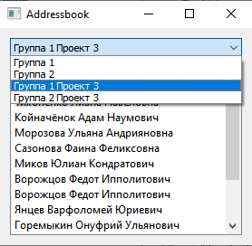

# Address book viewer

Addressbook viewer is GUI a C++ program using Qt framework for drawing and straightforward manipulation that join predefined corresponding  rows between two Sqlite database tables.
Based on the model/view architecture.
Read detailed [description](task/test.pdf) of a program.

* User interface design snapshot

 

* Database schema 

      CREATE TABLE prj_group 
      (
      prj_group_id INTEGER PRIMARY KEY AUTOINCREMENT  NOT NULL,
      project_id   INTEGER NOT NULL,
      name         TEXT    NOT NULL,
    
      CONSTRAINT fk_prj_group_project_1 
      FOREIGN KEY (project_id)
      REFERENCES project (project_id) ON DELETE CASCADE ON UPDATE CASCADE,
      );

      CREATE TABLE prj_group_addrbook 
      (
      prj_group_addrbook_id INTEGER PRIMARY KEY AUTOINCREMENT NOT NULL,
      prj_group_id          INTEGER NOT NULL DEFAULT 0,
      family                TEXT,
      first_name            TEXT,
      second_name           TEXT,
    
      CONSTRAINT fk_prj_group_addrbook_prj_group_1 
      FOREIGN KEY (prj_group_id)
      REFERENCES prj_group (prj_group_id) ON DELETE CASCADE ON UPDATE CASCADE,
      );

Caveats
-------
* Read only mode. Editing is not suggested.
* No tracking database changes during application running.

## Getting Started

These tiny instructions will help you build project and running on your computer.

Short way is using [Qt Creator](https://www.qt.io/product/development-tools).

### Requirements

Qt 5.12

### Installing

Generate a makefile.

Makefiles are generated from the '.pro' files like this:

    qmake -o Makefile Addressbook.pro 

Run make

    make

## Usage

Run
 

## Built With

* [SqliteStudio](https://sqlitestudio.pl/) - Used to generate database

## Contributing

Pull requests are welcome. 

## Authors

* **Denis Vasilenko** - *Initial work* - [tuxtender](https://github.com/tuxtender)

## License 

GNU GENERAL PUBLIC LICENSE  
Version 3, 29 June 2007

This program is free software: you can redistribute it and/or modify
it under the terms of the GNU General Public License as published by
the Free Software Foundation, either version 3 of the License, or
(at your option) any later version.

This program is distributed in the hope that it will be useful,
but WITHOUT ANY WARRANTY; without even the implied warranty of
MERCHANTABILITY or FITNESS FOR A PARTICULAR PURPOSE.  See the
GNU General Public License for more details.

You should have received a copy of the GNU General Public License
along with this program.  If not, see <https://www.gnu.org/licenses/>.